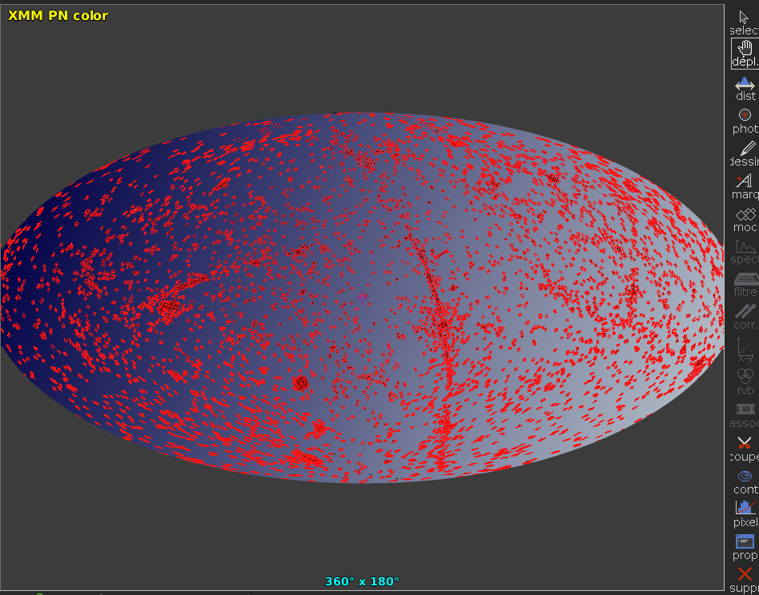
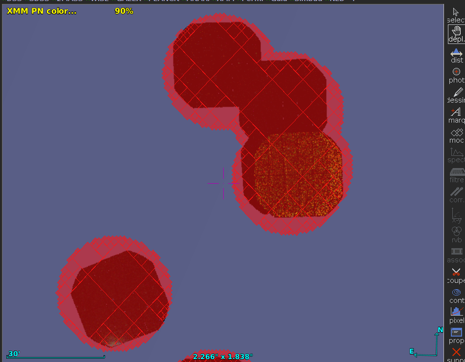
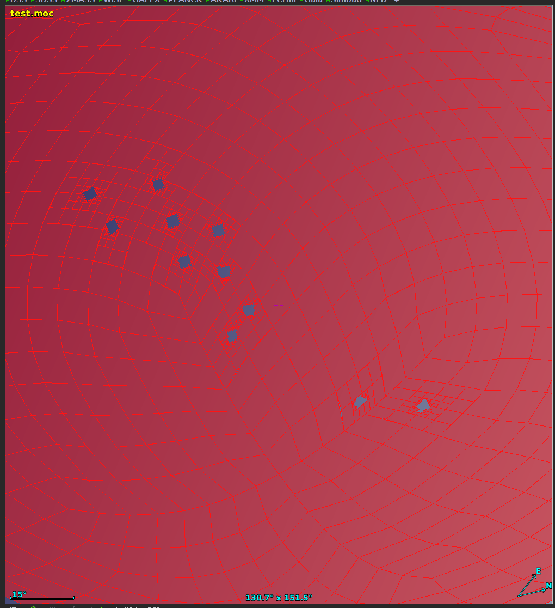

<meta charset="utf-8"/>

# `moc-cli`

Executable to read/write/create/manipulate HEALPix **M**ulti-**O**rder **C**overage maps (**MOC**s) using command lines.


## About

This **C**ommand **Line** **I**nterface (CLI) is made from the [Rust MOC library](https://github.com/cds-astro/cds-moc-rust).
It implements the v2.0 of the [MOC standard](https://ivoa.net/documents/MOC/),
including (S-)MOCs, T-MOCs and ST-MOCs.

For tools able to display MOCs, see:
* the [Aladin Desktop](https://aladin.u-strasbg.fr/) sky atlas in Java (also supports MOC operations)
* the [Aladin Lite](https://aladin.u-strasbg.fr/AladinLite/), "a lightweight version of the Aladin Sky Atlas running in the browser".
* [MOCPy](https://cds-astro.github.io/mocpy/), a python wrapper using the very same Rust MOC library.

## Install

### Debian package

Download the last `moc-cli_vxx_yyy.deb` corresponding to your architecture 
(`x86_64_musl` has the most chances to fit your needs)
from the [github release page](https://github.com/cds-astro/cds-moc-rust/releases).

Install the `.deb` by clicking on it or using the command line:
```bash
sudo dpkg -i moc-cli_vxx_yyy.deb
sudo apt-get install -f
```

Then you can use the tool:
```bash
moc-cli
man moc-cli
```

You can uninstall using, e.g.:
```bash
sudo dpkg -r $(dpkg -f moc-cli_vxx_yyy.deb Package)
```

WARNING: using this method, the command line name is `moc-cli` instead of `moc` due to a conflict with an existing debian `moc` package.


### Pre-compile binaries for MacOS, Linux and Windows

Download the last `moc-vxx_yyy.tar.gz` corresponding to your architecture 
from the [github release page](https://github.com/cds-astro/cds-moc-rust/releases).
You probably want ot use:
* Linux: `moc-vxx-x86_64-unknown-linux-musl.tar.gz`
* MacOS: `moc-vxx-x86_64-apple-darwin.tar.gz`
* Windows: `moc-vxx-.zip`

WARNING: for linux, use [`musl`](https://en.wikipedia.org/wiki/Musl) instead of `gnu` (high chances of uncompatibility in the latter case)

The tar contains a single executable binary file.
```bash
tar xzvf moc-vxx-yyy.tar.gz
./moc
```

### Compile from source code

[Install rust](https://www.rust-lang.org/tools/install)
(and check that `~/.cargo/bin/` is in your path),
or update the Rust compiler with:
```bash
rustup update
``` 

Install from [crates.io] using `cargo`:
```bash
cargo install moc-cli
```
(due to a heavy use of [monomorphization](https://en.wikipedia.org/wiki/Monomorphization),
the compilation time may be very long, i.e. more than a minute).


## Command line help

Once installed, you can get help messages using `moc [SUBCOMMAND [SUBSUBCOMMAND [...]]] --help`. 

A the root level `moc --help`:
```bash
Create, manipulate and filter files using HEALPix Multi-Order Coverage maps (MOCs).

USAGE:
    moc <SUBCOMMAND>

[...]

SUBCOMMANDS:
    convert    Converts an input format to the (most recent versions of) an output format
    filter     Filter file rows using a MOC
    from       Create a MOC from given parameters
    help       Prints this message or the help of the given subcommand(s)
    info       Prints information on the given MOC
    op         Perform operations on MOCs
    table      Prints MOC constants
```

`moc from --help`:
```bash
USAGE:
    moc from <SUBCOMMAND>

[...]

SUBCOMMANDS:
    box             Create a Spatial MOC from the given box
    cone            Create a Spatial MOC from the given cone
    cones           Create a Spatial MOC from a list of cones with centers and radius in decimal degrees (one pair
                    per line, format: longitude_deg,latitude_deg,radius_deg)
    ellipse         Create a Spatial MOC from the given elliptical cone
    help            Prints this message or the help of the given subcommand(s)
    multi           Create a Spatial MOC from regions in a CSV input. One region per input line. Format: *
                    cone,center_lon_deg,center_lat_deg,radius_deg *
                    ellipse,center_lon_deg,center_lat_deg,semi_maj_axis_deg,semi_min_axis_deg,position_angle_deg *
                    ring,center_lon_deg,center_lat_deg,internal_radius_deg,external_radius_deg *
                    box,center_lon_deg,center_lat_deg,semi_maj_axis_deg,semi_min_axis_deg,position_angle_deg *
                    zone,lon_min_deg,lat_min_deg,lon_max_deg,lat_max_deg *
                    polygon(,complement),vertex_lon_deg_1,vertex_lat_deg_1,vertex_lon_deg_2,vertex_lat_deg_2,...,vertex_lon_deg_n,vertex_lat_deg_n
    polygon         Create a Spatial MOC from the given polygon
    pos             Create a Spatial MOC from a list of positions in decimal degrees (one pair per line, longitude
                    first, then latitude)
    ring            Create a Spatial MOC from the given ring
    timerange       Create a Time MOC from a list of time range (one range per line, lower bound first, then upper
                    bound)
    timerangepos    Create a Space-Time MOC from a list of time range and positions in decimal degrees (tmin first,
                    then tmax, then longitude, and latitude)..
    timestamp       Create a Time MOC from a list of timestamp (one per line)
    timestamppos    Create a Space-Time MOC from a list of timestamp and positions in decimal degrees (timestamp
                    first, then longitude, then latitude)..
    vcells          Multi-order map input file format
    zone            Create a Spatial MOC from the given zone
```

`moc op --help`:
```bash
USAGE:
    moc op <SUBCOMMAND>

[...]

SUBCOMMANDS:
    complement    Performs a logical 'NOT' on the input MOC (= MOC complement)
    contract      Remove an the internal border made of cells having the MOC depth, SMOC only
    degrade       Degrade the input MOC (= MOC complement)
    diff          Performs a logical 'XOR' between 2 MOCs (= MOC difference)
    extborder     Returns the MOC external border (made of cell of depth the MOC depth), SMOC only
    extend        Add an extra border of cells having the MOC depth, SMOC only
    help          Prints this message or the help of the given subcommand(s)
    intborder     Returns the MOC internal border (made of cell of depth the MOC depth), SMOC only
    inter         Performs a logical 'AND' between 2 MOCs (= MOC intersection)
    minus         Performs the logical operation 'AND(left, NOT(right))' between 2 MOCs (= left minus right)
    sfold         Returns the union of the T-MOCs associated to S-MOCs intersecting the given S-MOC. Left: S-MOC,
                  right: ST-MOC, res: T-MOC
    split         Split the disjoint parts of the MOC into distinct MOCs, SMOC only. WARNING: this may create a lot
                  of files, use first option `--count`
    tfold         Returns the union of the S-MOCs associated to T-MOCs intersecting the given T-MOC. Left: T-MOC,
                  right: ST-MOC, res: S-MOC
    union         Performs a logical 'OR' between 2 MOCs (= MOC union)
```

and so on (e.g `moc op degrade --help`).

## Examples

```bash
moc table space
moc info resources/V_147_sdss12.moc.fits
moc info resources/CDS-I-125A-catalog_MOC.fits
moc op inter resources/V_147_sdss12.moc.fits resources/CDS-I-125A-catalog_MOC.fits fits my_res.fits
moc info my_res.fits

moc from cone 11 0.0 +0.0 0.1 ascii --fold 50 my_cone.ascii
moc convert -t smoc my_cone.ascii fits -f my_cone.fits
moc from ring 10 13.158329 -72.80028  5.64323 10.0 ascii --fold 80
```

Building a MOC from the [Hipparcos](https://vizier.u-strasbg.fr/viz-bin/VizieR-3?-source=I/239/hip_main&-out.max=50&-out.form=HTML%20Table&-out.add=_r&-out.add=_RAJ,_DEJ&-sort=_r&-oc.form=sexa)
positions:
```bash
egrep "^ *[0-9]" hip.psv | cut -d '|' -f 2-3 | tr -d ' ' | moc from pos 5 - --separator '|' ascii
```

### Build a MOC from XMM observation list

Build a raw MOC from the list of XMM observations, considering a radius of 17 arcmin around
each observation center.
The `xmmdr11_obs_center.17arcmin.csv` file contains 12210 `RA_CENTER,DEC_CENTER,17arcmin` rows.

Excerpt of the `xmmdr11_obs_center.17arcmin.csv` file:
```
> head -10 xmmdr11_obs_center.17arcmin.csv
64.89763,56.02272,0.283333333
263.65793,-32.556,0.283333333
99.36542,6.1115,0.283333333
193.49612,10.215167,0.283333333
58.45729,23.414083,0.283333333
187.05229,-15.758583,0.283333333
167.09784,-77.61408,0.283333333
196.76967,-23.647583,0.283333333
121.03321,5.086472,0.283333333
17.898624,-38.09336,0.283333333
...
```

Create the MOC

```bash
> time moc from cones -s , 12 ../../resources/xmmdr11_obs_center.17arcmin.csv fits --force-u64 xmm.moc.fits

real	0m2,852s
user	0m2,812s
sys	0m0,028s

> moc info xmm.moc.fits
MOC type: SPACE
MOC index type: u64
MOC depth: 12
MOC coverage:   3.962597748 %
```




### Build a MOC from a multi-region file

Build a raw MOC from a list of polygon.
The `polygon_list.txt` file contains 1787 `POLYGON lon1_deg lat1_deg lon2_deg lat2_deg lon3_deg lat3_deg lon4_deg lat4_deg` rows.

Excerpt of the `polygon_list.txt` file:
```
> head -10 polygon_list.txt
POLYGON 132.27592361897194 -85.50776984199415 227.28213604169053 -85.52848858549962 317.3696636049649 -85.13473097310337 42.70728242909465 -85.11295896964907
POLYGON 60.13229923319004 -86.16765734057081 300.83194062732554 -86.17690658712614 339.2709854792048 -80.83619292300155 21.676880345899917 -80.83215524499103
POLYGON 95.08276649945338 -86.21643167152601 335.2202213021057 -86.150123609087 13.974112489662907 -80.8408533466873 56.47368697052322 -80.86811225215042
POLYGON 131.43710822387513 -86.39620351676153 8.178879432043509 -86.09619481394972 48.49769627242518 -80.91228518381683 91.58845924785103 -81.03726056953703
POLYGON 169.54242332201397 -86.41549363302556 41.96380368178154 -86.22055148573337 83.93923381023212 -81.07936822440465 127.76955702379145 -81.16012444797337
POLYGON 209.38441456079454 -86.4385049405928 76.79919106658016 -86.34575852902184 120.7627522443793 -81.26318262561986 165.44708425571173 -81.30186091232301
POLYGON 247.79227731086206 -86.41524470836133 113.93143603491714 -86.4038508557833 158.42057918850884 -81.32131955955516 203.32586412458323 -81.32529595069136
POLYGON 284.61617428938314 -86.30625319728074 151.35533186836295 -86.4968774518728 195.56600175472337 -81.34533854250965 240.3724573793694 -81.26497727688265
POLYGON 319.9366584543485 -86.20323016702716 191.02944591530553 -86.47600995359106 233.34166080086834 -81.22312388507225 277.40115124704073 -81.10906373841831
POLYGON 352.72112816815314 -86.11070694641083 229.39278681105083 -86.38518393742109 269.2801464003224 -81.03542860454485 312.382448010481 -80.92171074918758
...
```
time moc from multi 12 ../../resources/polygon_list.txt fits --force-u64 test.moc.fits

```bash
> time moc from multi 12 resources/polygon_list.txt fits --force-u64 test.moc.fits

real	0m5,891s
user	0m5,852s
sys	0m0,008s

> moc info test.moc.fits
MOC type: SPACE
MOC index type: u64
MOC depth: 12
MOC coverage:  99.697673817 %
```



In the example, all regions are polygons, but it is also possible to mix regions in a single file usong the syntax:
```txt
CONE lon_deg lat_deg radius_deg
ELLIPSE lon_deg lat_deg a_deg b_deg pa_deg
RING lon_deg lat_deg internal_radius_deg external_radius_deg
BOX lon_deg lat_deg a_deg b_deg pa_deg
ZONE lon_min_deg lat_min_deg lon_max_deg lat_max_deg
POLYGON lon1_deg lat1_deg lon2_deg lat2_deg ... lonn_deg latn_deg
POLYGON complement lon1_deg lat1_deg lon2_deg lat2_deg ... lonn_deg latn_deg
```

## Performances hint

### Build MOC from positions

On a regular desktop, it takes **3.7s** to build the MOC at **order 7** of the **16,622,442** positions of the
[KIDS DR2](https://vizier.u-strasbg.fr/viz-bin/VizieR-3?-source=II/344&-out.max=50&-out.form=HTML%20Table&-out.add=_r&-out.add=_RAJ,_DEJ&-sort=_r&-oc.form=sexa)
table:
```bash
time moc from pos 7 kids_dr2.csv -s , ascii --fold 80 > kids_dr2.moc.ascii
> 3.7s on 16_622_442 position in a file of 552 MB
```

### Filter file using a MOC

On a classical HDD (~130 MB/s), the disk is the limiting factor when filtering a file.
Tests performed on a 25 GB file containing 16_622_443 rows (KIDS DR2):

|              |       HDD        |       SSD       |
|--------------|------------------|-----------------|
| `wc -l`      | 3m21s = 127 MB/s | 19s = 1347 MB/s |
| `moc filter` | 3m21s = 127 MB/s | 31s =  825 MB/s |

We get the same results with or without multithreading.  

Now we select only 3 fields. We get a ~1 GB (961 MB) file.
Since the results are the same for HDD and SSD, we deduce that the full file is in the disk cache:

|                 |       HDD        |       SSD       |
|-----------------|------------------|-----------------|
| `wc -l`         | 0.3s = 3200 MB/s | 0.3s = 3200 MB/s |
| `moc filter`    | 4s   =  240 MB/s | 4s   =  240 MB/s |
| `moc filter 4T` | 2s   =  480 MB/s | 2s   =  480 MB/s |

Commands used:
```bash
time moc filter position SMOC_GLIMPSE_u32.fits kids_dr2.csv --has-header --lon RAJ2000 --lat DECJ2000 > /dev/null
time moc filter position SMOC_GLIMPSE_u32.fits kids_dr2.csv --has-header --lon RAJ2000 --lat DECJ2000 --n-threads 4 > /dev/null
```
(no rows in output)


## To-do list

* [ ] Contact [gnuastro](https://www.gnu.org/software/gnuastro) ?
* [ ] Add filter on ST-MOCs
* [ ] Add ST-MOC 'intersection' and 'folds' in streaming mode (for a low memory footprint)
* [ ] Add an option `overlapping (default), fully inside, partially inside, center inside` 
      for cone, polygon, ...
* [ ] Support valued MOCs (<=> Multi-Order Maps)?


## License

Like most projects in Rust, this project is licensed under either of

* Apache License, Version 2.0, ([LICENSE-APACHE](LICENSE-APACHE) or
  http://www.apache.org/licenses/LICENSE-2.0)
* MIT license ([LICENSE-MIT](LICENSE-MIT) or
  http://opensource.org/licenses/MIT)

at your option.


## Contribution

Unless you explicitly state otherwise, any contribution intentionally submitted
for inclusion in this project by you, as defined in the Apache-2.0 license,
shall be dual licensed as above, without any additional terms or conditions.


## Acknowledgements

This work has been supported by the ESCAPE project.  
ESCAPE - The **E**uropean **S**cience **C**luster of **A**stronomy & **P**article Physics **E**SFRI Research Infrastructures -
has received funding from the **European Union’s Horizon 2020** research and innovation programme under **Grant Agreement no. 824064**.

