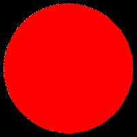
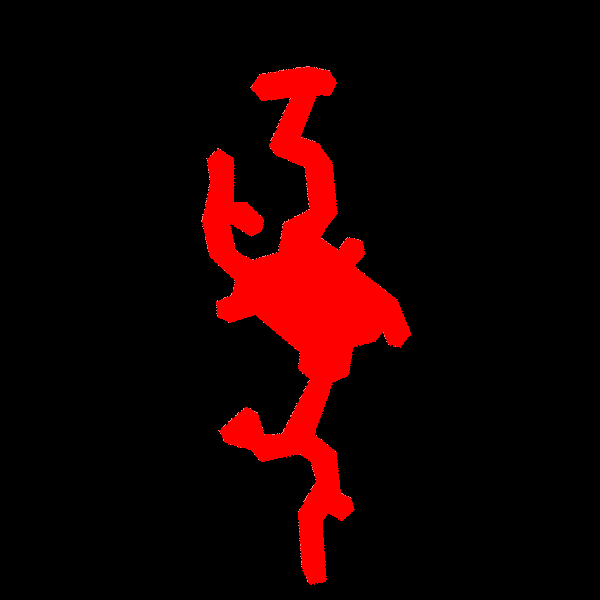
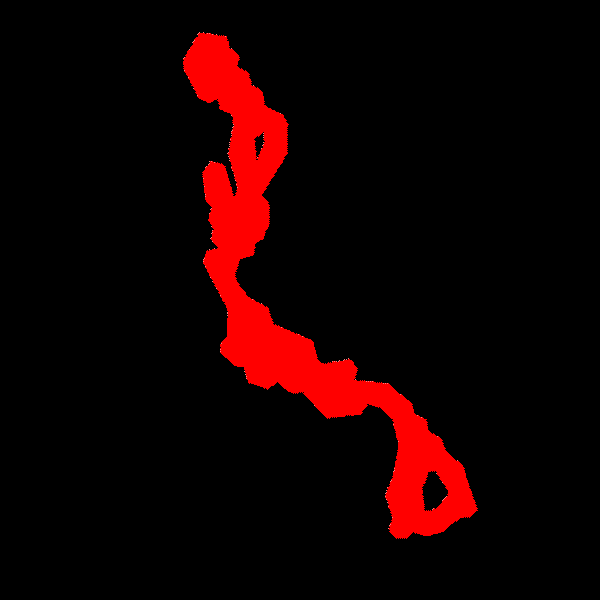

# `moc-cli`

A command-line to create and manipulate HEALPix **M**ulti-**O**rder **C**overage maps (**MOC**s),
, see [this IVOA standard](https://ivoa.net/documents/MOC).

## About

This **C**ommand **Line** **I**nterface (CLI) is made from the [Rust MOC library](https://github.com/cds-astro/cds-moc-rust).
It implements the v2.0 of the [MOC standard](https://ivoa.net/documents/MOC/),
including (S-)MOCs, T-MOCs and ST-MOCs.

For tools able to display MOCs, see:
* the [Aladin Desktop](https://aladin.u-strasbg.fr/) sky atlas in Java (also supports MOC operations)
* the [Aladin Lite](https://aladin.u-strasbg.fr/AladinLite/), "a lightweight version of the Aladin Sky Atlas running in the browser".
* [MOCPy](https://cds-astro.github.io/mocpy/), a python wrapper using the very same Rust MOC library.

## Install

### From pypi for python users

MOC cli is available in [pypi](https://pypi.org/project/moc-cli), 
you can thus install the `moc` executable using `pip`:
```bash
pip install -U moc-cli
moc --help
```

### Debian package

Download the last `moc-cli_vxx_yyy.deb` corresponding to your architecture 
(`x86_64_musl` has the most chances to fit your needs)
from the [github release page](https://github.com/cds-astro/cds-moc-rust/releases).

Install the `.deb` by clicking on it or using the command line:
```bash
sudo dpkg -i moc-cli_vxx_yyy.deb
sudo apt-get install -f
```

Then you can use the tool:
```bash
moc-cli
man moc-cli
```

You can uninstall using, e.g.:
```bash
sudo dpkg -r $(dpkg -f moc-cli_vxx_yyy.deb Package)
```

WARNING: using this method, the command line name is `moc-cli` instead of `moc` due to a conflict with an existing debian `moc` package.


### Pre-compile binaries for MacOS, Linux and Windows

Download the last `moc-vxx_yyy.tar.gz` corresponding to your architecture 
from the [github release page](https://github.com/cds-astro/cds-moc-rust/releases).
You probably want ot use:
* Linux: `moc-vxx-x86_64-unknown-linux-musl.tar.gz`
* MacOS: `moc-vxx-x86_64-apple-darwin.tar.gz`
* Windows: `moc-vxx-.zip`

WARNING: for linux, use [`musl`](https://en.wikipedia.org/wiki/Musl) instead of `gnu` (high chances of uncompatibility in the latter case)

The tar contains a single executable binary file.
```bash
tar xzvf moc-vxx-yyy.tar.gz
./moc
```

### Compile from source code

[Install rust](https://www.rust-lang.org/tools/install)
(and check that `~/.cargo/bin/` is in your path),
or update the Rust compiler with:
```bash
rustup update
``` 

Clone the [moc lib rust](https://github.com/cds-astro/cds-moc-rust) project:
```bash
git clone https://github.com/cds-astro/cds-moc-rust
```
Install from using `cargo`:
```bash
cargo install --path crates/cli
```
(due to a heavy use of [monomorphization](https://en.wikipedia.org/wiki/Monomorphization),
the compilation time may be very long, i.e. more than a minute).


## Command line help

Once installed, you can get help messages using `moc [SUBCOMMAND [SUBSUBCOMMAND [...]]] --help`. 

A the root level `moc --help`:
```bash
Create, manipulate and filter files using HEALPix Multi-Order Coverage maps (MOCs).

USAGE:
    moc <SUBCOMMAND>

[...]

SUBCOMMANDS:
    convert    Converts an input format to the (most recent versions of) an output format
    filter     Filter file rows using a MOC
    from       Create a MOC from given parameters
    help       Prints this message or the help of the given subcommand(s)
    info       Prints information on the given MOC
    op         Perform operations on MOCs
    table      Prints MOC constants
```

`moc from --help`:
```bash
USAGE:
    moc from <SUBCOMMAND>

[...]

SUBCOMMANDS:
    box             Create a Spatial MOC from the given box
    cone            Create a Spatial MOC from the given cone
    cones           Create a Spatial MOC from a list of cones with centers and radius in decimal degrees (one pair
                    per line, format: longitude_deg,latitude_deg,radius_deg)
    ellipse         Create a Spatial MOC from the given elliptical cone
    help            Prints this message or the help of the given subcommand(s)
    multi           Create a Spatial MOC from regions in a CSV input. One region per input line. Format: *
                    cone,center_lon_deg,center_lat_deg,radius_deg *
                    ellipse,center_lon_deg,center_lat_deg,semi_maj_axis_deg,semi_min_axis_deg,position_angle_deg *
                    ring,center_lon_deg,center_lat_deg,internal_radius_deg,external_radius_deg *
                    box,center_lon_deg,center_lat_deg,semi_maj_axis_deg,semi_min_axis_deg,position_angle_deg *
                    zone,lon_min_deg,lat_min_deg,lon_max_deg,lat_max_deg *
                    polygon(,complement),vertex_lon_deg_1,vertex_lat_deg_1,vertex_lon_deg_2,vertex_lat_deg_2,...,vertex_lon_deg_n,vertex_lat_deg_n
    polygon         Create a Spatial MOC from the given polygon
    pos             Create a Spatial MOC from a list of positions in decimal degrees (one pair per line, longitude
                    first, then latitude)
    ring            Create a Spatial MOC from the given ring
    stcs            Create a Spatial MOC from a STC-S input
    timerange       Create a Time MOC from a list of time range (one range per line, lower bound first, then upper
                    bound)
    timerangepos    Create a Space-Time MOC from a list of time range and positions in decimal degrees (tmin first,
                    then tmax, then longitude, and latitude)..
    timestamp       Create a Time MOC from a list of timestamp (one per line)
    timestamppos    Create a Space-Time MOC from a list of timestamp and positions in decimal degrees (timestamp
                    first, then longitude, then latitude)..
    vcells          Multi-order map input file format
    zone            Create a Spatial MOC from the given zone
```

`moc op --help`:
```bash
USAGE:
    moc op <SUBCOMMAND>

[...]

SUBCOMMANDS:
    complement    Performs a logical 'NOT' on the input MOC (= MOC complement)
    contract      Remove an the internal border made of cells having the MOC depth, SMOC only
    degrade       Degrade the input MOC (= MOC complement)
    diff          Performs a logical 'XOR' between 2 MOCs (= MOC difference)
    extborder     Returns the MOC external border (made of cell of depth the MOC depth), SMOC only
    extend        Add an extra border of cells having the MOC depth, SMOC only
    help          Prints this message or the help of the given subcommand(s)
    intborder     Returns the MOC internal border (made of cell of depth the MOC depth), SMOC only
    inter         Performs a logical 'AND' between 2 MOCs (= MOC intersection)
    minus         Performs the logical operation 'AND(left, NOT(right))' between 2 MOCs (= left minus right)
    sfold         Returns the union of the T-MOCs associated to S-MOCs intersecting the given S-MOC. Left: S-MOC,
                  right: ST-MOC, res: T-MOC
    split         Split the disjoint parts of the MOC into distinct MOCs, SMOC only. WARNING: this may create a lot
                  of files, use first option `--count`
    tfold         Returns the union of the S-MOCs associated to T-MOCs intersecting the given T-MOC. Left: T-MOC,
                  right: ST-MOC, res: S-MOC
    union         Performs a logical 'OR' between 2 MOCs (= MOC union)
```

and so on (e.g `moc op degrade --help`).

## Examples

```bash
moc table space
moc info resources/V_147_sdss12.moc.fits
moc info resources/CDS-I-125A-catalog_MOC.fits
moc op inter resources/V_147_sdss12.moc.fits resources/CDS-I-125A-catalog_MOC.fits fits my_res.fits
moc info my_res.fits

moc from cone 11 0.0 +0.0 0.1 ascii --fold 50 my_cone.ascii
moc convert -t smoc my_cone.ascii fits -f my_cone.fits
moc from ring 10 13.158329 -72.80028  5.64323 10.0 ascii --fold 80

## Frequency MOCs
echo "0/0 8/" | moc hprint --type fmoc --format ascii -
echo "0/0-1 8/" | moc convert --type smoc --format ascii - fits moc.d8.allfreq.fits
moc info moc.d8.allfreq.fits
moc hprint moc.d8.allfreq.fits

for f in {0..63}; do echo "5/$f" | moc hprint --type fmoc --format ascii - --no-header; done
for f in {0..511}; do echo "8/$f" | moc hprint --type fmoc --format ascii - --no-header; done
for f in {0..1023}; do echo "9/$f" | moc hprint --type fmoc --format ascii - --no-header; done

for f in {0..8191}; do echo "12/$f" | moc hprint --type fmoc --format ascii - --no-header; done
for f in {0..65536}; do echo "15/$f" | moc hprint --type fmoc --format ascii - --no-header; done

echo "0.125
0.2569
0.1478
0.9985
1.5983
20.256
3500" | \
moc from freqval 9 - ascii | \
moc hprint --type fmoc --format ascii -

```

Building a MOC from the [Hipparcos](https://vizier.u-strasbg.fr/viz-bin/VizieR-3?-source=I/239/hip_main&-out.max=50&-out.form=HTML%20Table&-out.add=_r&-out.add=_RAJ,_DEJ&-sort=_r&-oc.form=sexa)
positions:
```bash
egrep "^ *[0-9]" hip.psv | cut -d '|' -f 2-3 | tr -d ' ' | moc from pos 5 - --separator '|' ascii
```

### Build a MOC from XMM observation list

Build a raw MOC from the list of XMM observations, considering a radius of 17 arcmin around
each observation center.
The `xmmdr11_obs_center.17arcmin.csv` file contains 12210 `RA_CENTER,DEC_CENTER,17arcmin` rows.

Excerpt of the `xmmdr11_obs_center.17arcmin.csv` file:
```
> head -10 xmmdr11_obs_center.17arcmin.csv
64.89763,56.02272,0.283333333
263.65793,-32.556,0.283333333
99.36542,6.1115,0.283333333
193.49612,10.215167,0.283333333
58.45729,23.414083,0.283333333
187.05229,-15.758583,0.283333333
167.09784,-77.61408,0.283333333
196.76967,-23.647583,0.283333333
121.03321,5.086472,0.283333333
17.898624,-38.09336,0.283333333
...
```

Create the MOC

```bash
> time moc from cones -s , 12 ../../resources/xmmdr11_obs_center.17arcmin.csv fits --force-u64 xmm.moc.fits

real	0m2,852s
user	0m2,812s
sys	0m0,028s

> moc info xmm.moc.fits
MOC type: SPACE
MOC index type: u64
MOC depth: 12
MOC coverage:   3.962597748 %

# Count the number of disjoint regions from the 12210 FOVs
> time moc op split --count /home/pineau/Eclipse/ARCHES/scriptsNoSync/xmm.moc.fits ascii
4414

real	0m2,617s
user	0m2,604s
sys	0m0,005s
```


### Build a S-MOC from a STC-S string

#### Example from the STC-S document:
```bash
echo "Circle ICRS 147.6 69.9 0.4" | moc from stcs 14 - fits stcs.moc.fits --force-u64
moc view stcs.moc.fits moc.png auto 200
```
Gives:




####  Union of polygons extracted from the ObsCore table in the ESO TAP service

```bash
echo "UNION ICRS (
    POLYGON 97.910103 -68.229734 98.035349 -68.420531 97.511326 -68.464218 97.391307 -68.272593 
    POLYGON J2000 97.188217 -68.288771 97.305736 -68.48057 96.776416 -68.522768 96.664513 -68.330377 
    POLYGON J2000 96.460678 -68.346375 96.570253 -68.53902 96.038308 -68.579466 95.934565 -68.386491 
    POLYGON J2000 95.729059 -68.401779 95.830709 -68.594846 95.299598 -68.633367 95.203792 -68.440235
    POLYGON J2000 98.143037 -68.584332 98.270871 -68.777025 97.738257 -68.822153 97.614955 -68.628624
    POLYGON J2000 97.40776 -68.64555 97.529291 -68.839407 96.99076 -68.882535 96.874102 -68.688121
    POLYGON J2000 96.665259 -68.704476 96.77987 -68.899046 96.23834 -68.939924 96.12885 -68.745102
    POLYGON J2000 95.919684 -68.760503 96.027183 -68.955344 95.486003 -68.993812 95.383753 -68.799015
    POLYGON J2000 98.380832 -68.941608 98.510226 -69.134393 97.970196 -69.180998 97.844529 -68.987451
    POLYGON J2000 97.634 -69.005104 97.757563 -69.198965 97.211008 -69.242868 97.091422 -69.048526
    POLYGON J2000 96.879196 -69.06502 96.997918 -69.25945 96.448228 -69.300719 96.333728 -69.1061
    POLYGON J2000 96.120984 -69.121688 96.233684 -69.316281 95.683977 -69.354548 95.575734 -69.160047
    POLYGON J2000 98.620662 -69.29853 98.74967 -69.489628 98.203593 -69.537139 98.077564 -69.345424
    POLYGON J2000 97.864897 -69.363161 97.991114 -69.554985 97.438647 -69.599924 97.315514 -69.407714
    POLYGON J2000 97.100269 -69.424445 97.22188 -69.616836 96.665842 -69.65841 96.54754 -69.46587
    POLYGON J2000 96.332041 -69.481439 96.448747 -69.674048 95.891855 -69.712065 95.778776 -69.519528
)" | sed -r 's/J2000//g' | \
moc from stcs 16 - fits stcs.fits --force-u64
moc view stcs.fits moc.png auto 600
```
Gives:


Remarks: 
* we so far support only `ICRS` so we replace the firts `J2000` in the original string by `ICRS`
* the STC-S is not standard (with respect to the STC-S draft) so we remove the `J2000` using `sed`.

####  Complex polygon

```bash
echo "Polygon ICRS 259.779020 -36.182932 259.776702 -36.186804 259.771638 -36.185890 
  259.772903 -36.170965 259.770948 -36.168452 259.766725 -36.170651 259.762834 -36.167880 
  259.763731 -36.165062 259.767126 -36.163827 259.768464 -36.153306 259.775446 -36.148788 
  259.769596 -36.135517 259.764601 -36.133574 259.763255 -36.126446 259.755778 -36.124821 
  259.753657 -36.122446 259.752091 -36.125717 259.748402 -36.126581 259.744966 -36.123224 
  259.749312 -36.114598 259.762948 -36.106041 259.759436 -36.103058 259.760376 -36.099663 
  259.765016 -36.098826 259.767684 -36.102082 259.773773 -36.098700 259.768227 -36.092652 
  259.769796 -36.079719 259.774018 -36.074916 259.779750 -36.073295 259.774669 -36.062560 
  259.770285 -36.062490 259.768332 -36.059390 259.770514 -36.056611 259.777253 -36.055429 
  259.792567 -36.057523 259.795238 -36.060699 259.791804 -36.064056 259.782410 -36.062939 
  259.789399 -36.075403 259.787283 -36.077757 259.778147 -36.080762 259.776591 -36.091715 
  259.784863 -36.095193 259.786494 -36.102683 259.794458 -36.104560 259.797513 -36.103525 
  259.800137 -36.102101 259.802003 -36.094898 259.795104 -36.098376 259.791948 -36.096974 
  259.791273 -36.094116 259.796555 -36.089885 259.800794 -36.089963 259.800636 -36.078803 
  259.805260 -36.076262 259.808825 -36.078801 259.807830 -36.084885 259.810448 -36.094643 
  259.808066 -36.103578 259.799912 -36.109740 259.801174 -36.113477 259.805956 -36.115134 
  259.805673 -36.118789 259.801985 -36.120191 259.794028 -36.118194 259.779591 -36.127983 
  259.780279 -36.132041 259.776522 -36.134755 259.785372 -36.148741 259.791126 -36.148934 
  259.793243 -36.143417 259.796550 -36.141837 259.805073 -36.147755 259.803338 -36.150735 
  259.794941 -36.152696 259.792043 -36.155585 259.779929 -36.153563 259.776332 -36.155577 
  259.774520 -36.160554 259.780315 -36.168504" | \
moc from stcs 18 - fits stcs_alma1.moc.fits --force-u64
moc view stcs_alma1.moc.fits stcs_alma1.moc.png auto 600
```

Gives:




####  Complex polygon with holes


Either 
```bash
echo "Difference ICRS (
    Polygon 272.536719 -19.461249 272.542612 -19.476380 272.537389 -19.491509 272.540192 -19.499823
            272.535455 -19.505218 272.528024 -19.505216 272.523437 -19.500298 272.514082 -19.503376
            272.502271 -19.500966 272.488647 -19.490390  272.481932 -19.490913 272.476737 -19.486589
            272.487633 -19.455645 272.500386 -19.444996 272.503003 -19.437557 272.512303 -19.432436
            272.514132 -19.423973 272.522103 -19.421523 272.524511 -19.413250 272.541021 -19.400024
            272.566264 -19.397500 272.564202 -19.389111 272.569055 -19.383210 272.588186 -19.386539
            272.593376 -19.381832 272.596327 -19.370541 272.624911 -19.358915 272.629256 -19.347842
            272.642277 -19.341020 272.651322 -19.330424 272.653174 -19.325079 272.648903 -19.313708
            272.639616 -19.311098 272.638128 -19.303083 272.632705 -19.299839 272.627971 -19.289408
            272.628226 -19.276293 272.633750 -19.270590 272.615109 -19.241810 272.614704 -19.221196
            272.618224 -19.215572 272.630809 -19.209945 272.633540 -19.198681 272.640711 -19.195292
            272.643028 -19.186751 272.651477 -19.182729 272.649821 -19.174859 272.656782 -19.169272
            272.658933 -19.161883 272.678012 -19.159481 272.689173 -19.176982 272.689395 -19.183512
            272.678006 -19.204016 272.671112 -19.206598 272.664854 -19.203523 272.662760 -19.211156
            272.654435 -19.214434 272.652969 -19.222085 272.656724 -19.242136 272.650071 -19.265092
            272.652868 -19.274296 272.660871 -19.249462 272.670041 -19.247807 272.675533 -19.254935
            272.673291 -19.273917 272.668710 -19.279245 272.671460 -19.287043 272.667507 -19.293933
            272.669261 -19.300601 272.663969 -19.307130 272.672626 -19.308954 272.675225 -19.316490
            272.657188 -19.349105 272.657638 -19.367455 272.662447 -19.372035 272.662232 -19.378566
            272.652479 -19.386871 272.645819 -19.387933 272.642279 -19.398277 272.629282 -19.402739
            272.621487 -19.398197 272.611782 -19.405716 272.603367 -19.404667 272.586162 -19.422703
            272.561792 -19.420008 272.555815 -19.413012 272.546500 -19.415611 272.537427 -19.424213
            272.533081 -19.441402
    Union (
        Polygon 272.511081 -19.487278 272.515300 -19.486595 272.517029 -19.471442
                272.511714 -19.458837 272.506430 -19.459001 272.496401 -19.474322 272.504821 -19.484924
        Polygon 272.630446 -19.234210 272.637274 -19.248542 272.638942 -19.231476 272.630868 -19.226364
    )
)"
```
or
```bash
echo "Intersection ICRS (
    Polygon 272.536719 -19.461249 272.542612 -19.476380 272.537389 -19.491509 272.540192 -19.499823
            272.535455 -19.505218 272.528024 -19.505216 272.523437 -19.500298 272.514082 -19.503376 
            272.502271 -19.500966 272.488647 -19.490390  272.481932 -19.490913 272.476737 -19.486589 
            272.487633 -19.455645 272.500386 -19.444996 272.503003 -19.437557 272.512303 -19.432436 
            272.514132 -19.423973 272.522103 -19.421523 272.524511 -19.413250 272.541021 -19.400024 
            272.566264 -19.397500 272.564202 -19.389111 272.569055 -19.383210 272.588186 -19.386539 
            272.593376 -19.381832 272.596327 -19.370541 272.624911 -19.358915 272.629256 -19.347842 
            272.642277 -19.341020 272.651322 -19.330424 272.653174 -19.325079 272.648903 -19.313708 
            272.639616 -19.311098 272.638128 -19.303083 272.632705 -19.299839 272.627971 -19.289408 
            272.628226 -19.276293 272.633750 -19.270590 272.615109 -19.241810 272.614704 -19.221196 
            272.618224 -19.215572 272.630809 -19.209945 272.633540 -19.198681 272.640711 -19.195292 
            272.643028 -19.186751 272.651477 -19.182729 272.649821 -19.174859 272.656782 -19.169272 
            272.658933 -19.161883 272.678012 -19.159481 272.689173 -19.176982 272.689395 -19.183512 
            272.678006 -19.204016 272.671112 -19.206598 272.664854 -19.203523 272.662760 -19.211156 
            272.654435 -19.214434 272.652969 -19.222085 272.656724 -19.242136 272.650071 -19.265092
            272.652868 -19.274296 272.660871 -19.249462 272.670041 -19.247807 272.675533 -19.254935 
            272.673291 -19.273917 272.668710 -19.279245 272.671460 -19.287043 272.667507 -19.293933
            272.669261 -19.300601 272.663969 -19.307130 272.672626 -19.308954 272.675225 -19.316490
            272.657188 -19.349105 272.657638 -19.367455 272.662447 -19.372035 272.662232 -19.378566
            272.652479 -19.386871 272.645819 -19.387933 272.642279 -19.398277 272.629282 -19.402739
            272.621487 -19.398197 272.611782 -19.405716 272.603367 -19.404667 272.586162 -19.422703
            272.561792 -19.420008 272.555815 -19.413012 272.546500 -19.415611 272.537427 -19.424213
            272.533081 -19.441402 
    Not (Polygon 272.511081 -19.487278 272.515300 -19.486595 272.517029 -19.471442 
                 272.511714 -19.458837 272.506430 -19.459001 272.496401 -19.474322 272.504821 -19.484924)
    Not (Polygon 272.630446 -19.234210 272.637274 -19.248542 272.638942 -19.231476 272.630868 -19.226364)
)" | \
moc from stcs 16 - fits stcs_alma2.moc.fits --force-u64
moc view stcs_alma2.moc.fits stcs_alma2.moc.png auto 600
```

Gives:




### Build a MOC from a (non STC-S) multi-region file

Remark: this has been done before the S-MOC from STC-S features, you can use both methods.

Build a raw MOC from a list of polygon.
The `polygon_list.txt` file contains 1787 `POLYGON lon1_deg lat1_deg lon2_deg lat2_deg lon3_deg lat3_deg lon4_deg lat4_deg` rows.

Excerpt of the `polygon_list.txt` file:
```
> head -10 polygon_list.txt
POLYGON 132.27592361897194 -85.50776984199415 227.28213604169053 -85.52848858549962 317.3696636049649 -85.13473097310337 42.70728242909465 -85.11295896964907
POLYGON 60.13229923319004 -86.16765734057081 300.83194062732554 -86.17690658712614 339.2709854792048 -80.83619292300155 21.676880345899917 -80.83215524499103
POLYGON 95.08276649945338 -86.21643167152601 335.2202213021057 -86.150123609087 13.974112489662907 -80.8408533466873 56.47368697052322 -80.86811225215042
POLYGON 131.43710822387513 -86.39620351676153 8.178879432043509 -86.09619481394972 48.49769627242518 -80.91228518381683 91.58845924785103 -81.03726056953703
POLYGON 169.54242332201397 -86.41549363302556 41.96380368178154 -86.22055148573337 83.93923381023212 -81.07936822440465 127.76955702379145 -81.16012444797337
POLYGON 209.38441456079454 -86.4385049405928 76.79919106658016 -86.34575852902184 120.7627522443793 -81.26318262561986 165.44708425571173 -81.30186091232301
POLYGON 247.79227731086206 -86.41524470836133 113.93143603491714 -86.4038508557833 158.42057918850884 -81.32131955955516 203.32586412458323 -81.32529595069136
POLYGON 284.61617428938314 -86.30625319728074 151.35533186836295 -86.4968774518728 195.56600175472337 -81.34533854250965 240.3724573793694 -81.26497727688265
POLYGON 319.9366584543485 -86.20323016702716 191.02944591530553 -86.47600995359106 233.34166080086834 -81.22312388507225 277.40115124704073 -81.10906373841831
POLYGON 352.72112816815314 -86.11070694641083 229.39278681105083 -86.38518393742109 269.2801464003224 -81.03542860454485 312.382448010481 -80.92171074918758
...
```
time moc from multi 12 ../../resources/polygon_list.txt fits --force-u64 test.moc.fits

```bash
> time moc from multi 12 resources/polygon_list.txt fits --force-u64 test.moc.fits

real	0m5,891s
user	0m5,852s
sys	0m0,008s

> moc info test.moc.fits
MOC type: SPACE
MOC index type: u64
MOC depth: 12
MOC coverage:  99.697673817 %
```


In the example, all regions are polygons, but it is also possible to mix regions in a single file usong the syntax:
```txt
CONE lon_deg lat_deg radius_deg
ELLIPSE lon_deg lat_deg a_deg b_deg pa_deg
RING lon_deg lat_deg internal_radius_deg external_radius_deg
BOX lon_deg lat_deg a_deg b_deg pa_deg
ZONE lon_min_deg lat_min_deg lon_max_deg lat_max_deg
POLYGON lon1_deg lat1_deg lon2_deg lat2_deg ... lonn_deg latn_deg
POLYGON complement lon1_deg lat1_deg lon2_deg lat2_deg ... lonn_deg latn_deg
```

## Example of Stream MOC

The input list must be sorted according to the HEALPix NESTED Z-order curve.
```bash
echo "qty=HPX
depth=6
29/210191438858682368-210261807602860032
29/1207809125065424896-1207879493809602560
29/1386193891555803136-1386264260299980800
29/1436648281131188224-1436718649875365888
29/1437703812293853184-1437774181038030848
29/1440025980851716096-1440096349595893760
29/1440237087084249088-1440307455828426752
29/2488801744075620352-2488872112819798016
" | moc convert - -f stream -t smoc fits mutlicone.moc.fits
```


## View a MOC

```bash
moc view CDS-I-125A-catalog_MOC.fits toto.png allsky 800
moc view CDS-I-125A-catalog_MOC.fits toto.png auto 800
moc view CDS-I-125A-catalog_MOC.fits toto.png custom -l 180.0 -b -45.0 sfl 1600 800
```

## Performances hint

### Build MOC from positions

On a regular desktop, it takes **3.7s** to build the MOC at **order 7** of the **16,622,442** positions of the
[KIDS DR2](https://vizier.u-strasbg.fr/viz-bin/VizieR-3?-source=II/344&-out.max=50&-out.form=HTML%20Table&-out.add=_r&-out.add=_RAJ,_DEJ&-sort=_r&-oc.form=sexa)
table:
```bash
time moc from pos 7 kids_dr2.csv -s , ascii --fold 80 > kids_dr2.moc.ascii
> 3.7s on 16_622_442 position in a file of 552 MB
```

### Filter file using a MOC

On a classical HDD (~130 MB/s), the disk is the limiting factor when filtering a file.
Tests performed on a 25 GB file containing 16_622_443 rows (KIDS DR2):

|              |       HDD        |       SSD       |
|--------------|------------------|-----------------|
| `wc -l`      | 3m21s = 127 MB/s | 19s = 1347 MB/s |
| `moc filter` | 3m21s = 127 MB/s | 31s =  825 MB/s |

We get the same results with or without multithreading.  

Now we select only 3 fields. We get a ~1 GB (961 MB) file.
Since the results are the same for HDD and SSD, we deduce that the full file is in the disk cache:

|                 |       HDD        |       SSD       |
|-----------------|------------------|-----------------|
| `wc -l`         | 0.3s = 3200 MB/s | 0.3s = 3200 MB/s |
| `moc filter`    | 4s   =  240 MB/s | 4s   =  240 MB/s |
| `moc filter 4T` | 2s   =  480 MB/s | 2s   =  480 MB/s |

Commands used:
```bash
time moc filter position SMOC_GLIMPSE_u32.fits kids_dr2.csv --has-header --lon RAJ2000 --lat DECJ2000 > /dev/null
time moc filter position SMOC_GLIMPSE_u32.fits kids_dr2.csv --has-header --lon RAJ2000 --lat DECJ2000 --n-threads 4 > /dev/null
```
(no rows in output)


## To-do list

* [ ] Remove `structop` and replace by `clap v3`
* [ ] MOC from cells (simpler than MOC from pos)
* [ ] SMOC from ranges (simpler than MOC from pos)
* [ ] MOC from vcells with a simple constraint? 
* [ ] Contact [gnuastro](https://www.gnu.org/software/gnuastro) ?
* [ ] Add filter on ST-MOCs
* [ ] Add ST-MOC 'intersection' and 'folds' in streaming mode (for a low memory footprint)
* [ ] Add an option `overlapping (default), fully inside, partially inside, center inside` 
      for cone, polygon, ...
* [ ] Support valued MOCs (<=> Multi-Order Maps)?


## License

Like most projects in Rust, this project is licensed under either of

* Apache License, Version 2.0, ([LICENSE-APACHE](LICENSE-APACHE) or
  http://www.apache.org/licenses/LICENSE-2.0)
* MIT license ([LICENSE-MIT](LICENSE-MIT) or
  http://opensource.org/licenses/MIT)

at your option.


## Contribution

Unless you explicitly state otherwise, any contribution intentionally submitted
for inclusion in this project by you, as defined in the Apache-2.0 license,
shall be dual licensed as above, without any additional terms or conditions.


## Acknowledgements

This work has been supported by the ESCAPE project.  
ESCAPE - The **E**uropean **S**cience **C**luster of **A**stronomy & **P**article Physics **E**SFRI Research Infrastructures -
has received funding from the **European Union’s Horizon 2020** research and innovation programme under **Grant Agreement no. 824064**.

