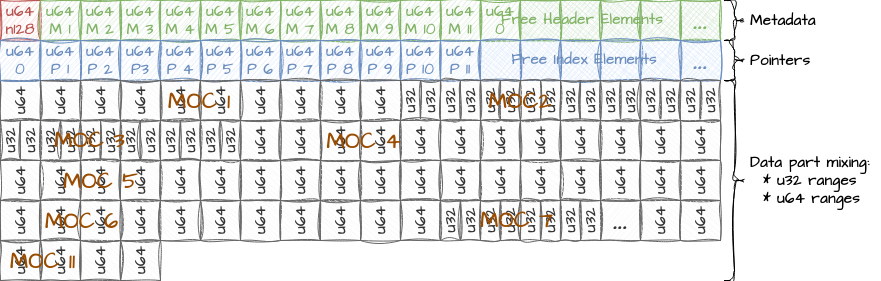
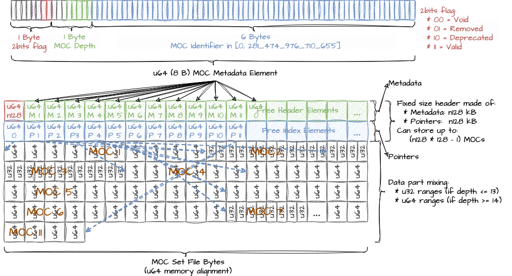
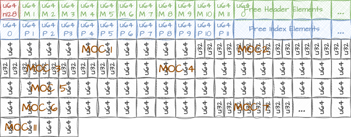
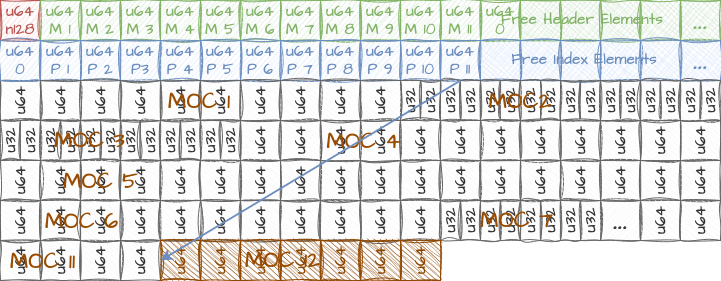
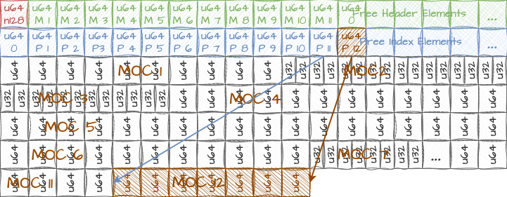
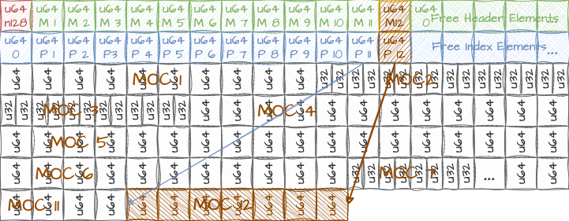
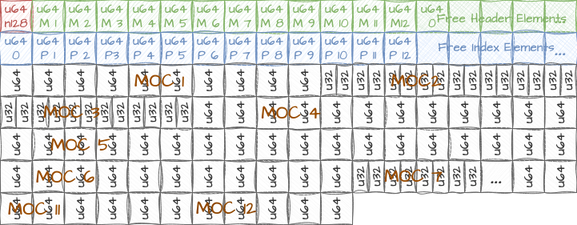

# moc-set

A command-line tool to build, update and query a **persistent** set of
Multi-Order Coverages maps (MOCs), see [this IVOA standard](https://ivoa.net/documents/MOC).

## About

Query a set of S-MOCs pre-saved in a single large binary file.  
The file can be seen as a persistent cache preventing
from having to open/read/parse a possible large set of FITS files.  
A `moc-set` can be updated by adding or removing MOCs from it, without having 
to re-build the full binary file (except from time to time using the `purge` command).
It is built in such a way that read operations are allowed while updating (add, remove, change status, purge) 
the binary file, but a write operation immediately fails (return status != 0) if another write operation 
is already ongoing.  


## Used by

MOC set in used:
* in production in [VizieR](https://vizier.u-strasbg.fr/viz-bin/VizieR) when querying a cone
  on the `> 16_000` catalogues
* in an ongoing project leading by [@lmichel](https://github.com/lmichel) to look for XMM FOVs intersecting a user define region.


## Similar to the [CDS MOC Server](http://alasky.unistra.fr/MocServer/query).  

The [CDS MOC Server](http://alasky.unistra.fr/MocServer/query) additionally stores metadata information associated 
to each MOC, allows queries with constraints on those metadata, and supports T-MOCs and ST-MOCs in addition to S-MOCs. 


So, `moc-set` offers functionalities similar to **a sub-part of** the MOC Server functionalities
(except for T-MOCs and ST-MOCs, one could build a MOC Server like service based on `moc-set`, 
using an additional mechanism to store and filter metadata).

The MOC Server is implemented in Java. All information used by the MOC Server are loaded 
in memory at service startup. To speed up the starting time, the MOC Server also resort on a binary dump, 
needing synchronisation mechanisms with the running server data when the list of MOCs is updated. 

`moc-set` has primarily been developed for VizieR needs: lighter/simpler version of the MOC server, with 
less information needed (VizieR already store catalogues metadata), system programming language with no runtime, 
possibly less memory available, ...


## Install

### From pypi for python users

MOCSet is available in [pypi](https://pypi.org/project/moc-set),
you can thus install the `mocset` executable using `pip`:
```bash
pip install -U moc-set
mocset --help
```

### Debian package

Download the last `mocset_vxx_yyy.deb` corresponding to your architecture
(`x86_64_musl` has the most chances to fit your needs)
from the [github release page](https://github.com/cds-astro/cds-moc-rust/releases).

Install the `.deb` by clicking on it or using the command line:
```bash
sudo dpkg -i mocset_vxx_yyy.deb
sudo apt-get install -f
```

Then you can use the tool:
```bash
mocset
man mocset
```

You can uninstall using, e.g.:
```bash
sudo dpkg -r $(dpkg -f mocset_vxx_yyy.deb Package)
```

### Pre-compile binaries for MacOS, Linux and Windows

Download the last `mocset-vxx_yyy.tar.gz` corresponding to your architecture
from the [github release page](https://github.com/cds-astro/cds-moc-rust/releases).
You probably want ot use:
* Linux: `mocset-vxx-x86_64-unknown-linux-musl.tar.gz`
* MacOS: `mocset-vxx-x86_64-apple-darwin.tar.gz`
* Windows: `mocset-vxx-.zip`

WARNING: for linux, use [`musl`](https://en.wikipedia.org/wiki/Musl) instead of `gnu` (high chances of incompatibility in the latter case)

The tar contains a single executable binary file.
```bash
tar xzvf mocset-vxx-yyy.tar.gz
./mocset
```

### Compile from source code

[Install rust](https://www.rust-lang.org/tools/install)
(and check that `~/.cargo/bin/` is in your path),
or update the Rust compiler with:
```bash
rustup update
``` 

Clone the [moc lib rust](https://github.com/cds-astro/cds-moc-rust) project:
```dtd
git clone https://github.com/cds-astro/cds-moc-rust
```
Install from using `cargo`:
```bash
cargo install --path crates/set
```
or
```
RUSTFLAGS='-C target-cpu=native' cargo install --path crates/set
```

## Usage

Exec `mocset --help` to get the help message:
```
> mocset --help
Command-line tool to build, update and query a persistent set of HEALPix Multi-Order Coverages maps (MOCs)

Usage: mocset <COMMAND>

Commands:
  make       Make a new mocset
  append     Append the given MOCs to an existing mocset
  chgstatus  Change the status flag of the given MOCs identifiers (valid, deprecated, removed)
  purge      Purge the mocset removing physically the MOCs flagged as 'removed'
  list       Provide the list of the MOCs in the mocset and the associated flags
  query      Query the mocset
  union      Union of all MOCs in the moc-set matching a given region
  extract    Extracts a MOC from the given moc-set
  help       Print this message or the help of the given subcommand(s)

Options:
  -h, --help     Print help
  -V, --version  Print version
```

### MOC set creation

Simply list in a csv file a set of identifier (integer in `[0, 281_474_976_710_655]`),
and MOC FITS file path. See e.g the file [moclist.txt](resources/tests/moclist.txt):
```bash
1,data/CDS_B_bax_bax.fits
2,data/CDS_I_172_irs.fits
3,data/CDS_I_274_ccdm.fits
4,data/CDS_I_42_catalog.fits
5,data/CDS_II_203A_faint.fits
6,data/CDS_II_261_GOODS_S.fits
7,data/CDS_II_339_summary.fits
8,data/CDS_II_97_ans.fits
9,data/CDS_III_206_orion.fits
10,data/CDS_III_43_main.fits
...
```

Then execute `moc-set` from the `mocset` command:
```bash
> mocset make --n128 3 --moc-list moclist.txt --delimiter , mocset.bin
```
or from the source code, [installing](https://www.rust-lang.org/tools/install) the Rust compiler (including Cargo):
```bash
> cargo run --release -- make --n128 3 --moc-list moclist.txt --delimiter , mocset.bin
```
To build the moc-set binary file `mocset.bin`.

The total number of MOCs that can be stored in the file equals `n128 * 128 - 1 (so 383 in the example above, since n128=3).


See the help message for more details:
```
> mocset make --help
Make a new mocset

Usage: mocset make [OPTIONS] <FILE>

Arguments:
  <FILE>  Output file, storing the MOC set

Options:
  -l, --moc-list <FILE>        Input file containing the 'moc_id moc_path' list (default: read from stdin) 'moc_id' must be a positive integer smaller than 281_474_976_710_655 (can be stored on 6 bytes). Use a negative value to flag as deprecated
  -d, --delimiter <SEPARATOR>  Delimiter used to separate the moc identifier from the moc path [default: " "]
  -n, --n128 <N128>            n x 128 - 1 = number of MOCs that can be stored in this moc set [default: 1]
  -h, --help                   Print help
```

### List the content of a MOC set

Simply use `mocset list`:
```
> mocset list mocset.bin
id,status,depth,n_ranges,byte_size
1,valid,11,1673,13384
2,valid,11,36022,288176
3,valid,11,55470,443760
4,valid,11,587,4696
5,valid,11,534,4272
6,valid,11,17,136
...
```
* `status`: can be `valid`, `deprecated` or `removed`
* `n_ranges`: number of ranges in the MOC
* `byte_size`: size of the MOC stored in the MOC set (in bytes)

See the help message:
```
> mocset list --help
Provide the list of the MOCs in the mocset and the associated flags

Usage: mocset list [OPTIONS] <FILE>

Arguments:
  <FILE>  The moc-set to be read

Options:
  -r, --ranges  Print byte ranges instead of byte_size
  -h, --help    Print help
```


### Querying a MOC set

See the help to get the different query modes:
```
> mocset query --help
Query the mocset

Usage: mocset query [OPTIONS] <FILE> <COMMAND>

Commands:
  pos   Single position
  cone  A cone, i.e. a position with a small area around (approximated by a MOC)
  moc   The given MOC (you create a moc using moc-cli and pipe it into moc-set)
  help  Print this message or the help of the given subcommand(s)

Arguments:
  <FILE>  The moc-set to be read

Options:
  -d, --add-deprecated       Also selects MOCs flagged as deprecated
  -c, --print-coverage       Print in output the sky fraction (in '[0.0, 1.0]') covered by each selected MOC
  -p, --parallel <PARALLEL>  Switch on multi-threading, with 'parallel' threads (made for SSD, not HDD)
  -h, --help                 Print help
```

#### Query for a single position

To obtain the list of the MOCs containing a the position 90.0 +0.0 (in decimal degrees), use:
```bash
> mocset query moclist.bin pos 90.0 +0.0
id
161
```
The result is the list of the identifier of the MOC covering the input position (only one MOC, with identifier 161 in our example).

See the full help:
```
> mocset query pos --help
Single position

Usage: mocset query <FILE> pos <LON_DEG> <LAT_DEG>

Arguments:
  <LON_DEG>  Longitude of the cone center (in degrees)
  <LAT_DEG>  Latitude of the cone center (in degrees)

Options:
  -h, --help  Print help
```


#### Query for a cone

To obtain the list of the MOCs overlapping the cone of center 90.0 +0.0 and having a radius of 320 arcsec, use:
```bash
> mocset query mocset.bin cone 90.0 +0.0 320.0 --precision 5
id
2
3
35
161
```

`--precision` is optional, its default value is 2:
 * at a `precision` of 0, `mocset` transforms the input cone in a MOC 
containing 1 to 9 values. 
 * at a `precision` of 1, `mocset` transforms the input cone in a MOC
containing 1 to `9x4` values.
 * at a `precision` of `n`, `mocset` transforms the input cone in a MOC
containing 1 to `9x4^n` values.

See the help:
```
> mocset query cone --help
A cone, i.e. a position with a small area around (approximated by a MOC)

Usage: mocset query <FILE> cone [OPTIONS] <LON_DEG> <LAT_DEG> <R_ARCSEC>

Arguments:
  <LON_DEG>   Longitude of the cone center (in degrees)
  <LAT_DEG>   Latitude of the cone center (in degrees)
  <R_ARCSEC>  Radius of the cone (in arcseconds)

Options:
  -p, --precision <PREC>  MOC precision; 0: depth 'd' at which the cone is overlapped by 1 to max 9 cells; 1: depth 'd' + 1; n: depth 'd' + n [default: 2]
  -i, --included          Returns MOCs containing the whole cone MOC (instead of overlapping only)
  -h, --help              Print help
```

#### Query for a MOC

To obtain the list of the MOCs overlapping the MOC stored in a given FITs file, e.g the MOC of XMM4 DR9, use:
```
> mocset query mocset.bin moc YOUR_PATH/CDS_IX_59_xmm4dr9s.fits
id
1
2
3
4
5
6
7
8
9
10
...
```

You may also use a MOC generate on the fly using [moc-cli](https://github.com/cds-astro/cds-moc-rust/tree/main/crates/cli)
```
> moc from polygon 5 "(0.0,0.0),(10.0,0.0),(0.0,10.0)" ascii | mocset query mocset.bin moc - --format ascii
id
1
2
3
4
7
8
13
26
27
35
36
60
63
...
```

See the help
```
> mocset query moc --help
The given MOC (you create a moc using moc-cli and pipe it into moc-set)

Usage: mocset query <FILE> moc [OPTIONS] <FILE>

Arguments:
  <FILE>  Path of the input MOC file (or stdin if equals "-")

Options:
  -f, --format <INPUT_FMT>  Format of the input MOC ('ascii', 'json' or 'fits') [default: guess from the file extension]
  -i, --included            Returns MOCs containing the whole given MOC (instead of overlapping)
  -h, --help                Print help
```

### Query from a STC-S region

You can query from a STC-S region using `moc-cli`:
```bash
echo "Intersection ICRS (
    Polygon 272.536719 -19.461249 272.542612 -19.476380 272.537389 -19.491509 272.540192 -19.499823
            272.535455 -19.505218 272.528024 -19.505216 272.523437 -19.500298 272.514082 -19.503376 
            272.502271 -19.500966 272.488647 -19.490390  272.481932 -19.490913 272.476737 -19.486589 
            272.487633 -19.455645 272.500386 -19.444996 272.503003 -19.437557 272.512303 -19.432436 
            272.514132 -19.423973 272.522103 -19.421523 272.524511 -19.413250 272.541021 -19.400024 
            272.566264 -19.397500 272.564202 -19.389111 272.569055 -19.383210 272.588186 -19.386539 
            272.593376 -19.381832 272.596327 -19.370541 272.624911 -19.358915 272.629256 -19.347842 
            272.642277 -19.341020 272.651322 -19.330424 272.653174 -19.325079 272.648903 -19.313708 
            272.639616 -19.311098 272.638128 -19.303083 272.632705 -19.299839 272.627971 -19.289408 
            272.628226 -19.276293 272.633750 -19.270590 272.615109 -19.241810 272.614704 -19.221196 
            272.618224 -19.215572 272.630809 -19.209945 272.633540 -19.198681 272.640711 -19.195292 
            272.643028 -19.186751 272.651477 -19.182729 272.649821 -19.174859 272.656782 -19.169272 
            272.658933 -19.161883 272.678012 -19.159481 272.689173 -19.176982 272.689395 -19.183512 
            272.678006 -19.204016 272.671112 -19.206598 272.664854 -19.203523 272.662760 -19.211156 
            272.654435 -19.214434 272.652969 -19.222085 272.656724 -19.242136 272.650071 -19.265092
            272.652868 -19.274296 272.660871 -19.249462 272.670041 -19.247807 272.675533 -19.254935 
            272.673291 -19.273917 272.668710 -19.279245 272.671460 -19.287043 272.667507 -19.293933
            272.669261 -19.300601 272.663969 -19.307130 272.672626 -19.308954 272.675225 -19.316490
            272.657188 -19.349105 272.657638 -19.367455 272.662447 -19.372035 272.662232 -19.378566
            272.652479 -19.386871 272.645819 -19.387933 272.642279 -19.398277 272.629282 -19.402739
            272.621487 -19.398197 272.611782 -19.405716 272.603367 -19.404667 272.586162 -19.422703
            272.561792 -19.420008 272.555815 -19.413012 272.546500 -19.415611 272.537427 -19.424213
            272.533081 -19.441402 
    Not (Polygon 272.511081 -19.487278 272.515300 -19.486595 272.517029 -19.471442 
                 272.511714 -19.458837 272.506430 -19.459001 272.496401 -19.474322 272.504821 -19.484924)
    Not (Polygon 272.630446 -19.234210 272.637274 -19.248542 272.638942 -19.231476 272.630868 -19.226364)
)" | moc from stcs 14 - ascii | mocset query mocset.bin moc - --format ascii
```


#### Generic parameter

For all queries, the option `--add-deprecated` (or `-d`) add the MOCs flagged as deprecated in
the output, e.g.:
```bash
mocset query --add-deprecated moclist.bin pos 90.0 +0.0 --precision 5
```

### Updating a MOC set

You can:
* `chgstatus` change the status of a MOC in the MOC set to flag it as `deprecated` or back to `valid`, 
  or as `removed` (WARNING: once removed, a MOC cannot be flagged back as `deprecated` or `valid`)
* `append` a new MOC at the end of the MOC set, the ID of a removed MOC can be reused
* `purge` a MOC set to physically remove all MOCs flagged as `removed`.
  This process basically re-write the whole MOC set file.
 
Example of usage of `chgstatus`
```
> mocset list mocset.bin
id,status,depth,n_ranges,byte_size
1,valid,11,1673,13384
2,valid,11,36022,288176
...
> mocset chgstatus mocset.bin 1 deprecated
> mocset list mocset.bin
id,status,depth,n_ranges,byte_size
1,deprecated,11,1673,13384
2,valid,11,36022,288176
...
> mocset chgstatus mocset.bin 1 valid
> mocset list mocset.bin
id,status,depth,n_ranges,byte_size
1,valid,11,1673,13384
2,valid,11,36022,288176
...
> mocset chgstatus mocset.bin 1 removed
> mocset list mocset.bin
id,status,depth,n_ranges,byte_size
1,removed,11,1673,13384
2,valid,11,36022,288176
...
```

Example of usage of `append`:
```
> mocset append mocset.bin 3000 MY_PATH/my_new_moc.fits
```

Example of usage of `purge`:
```
> mocset purge mocset.bin
```

Help messages:
```
> mocset chgstatus --help
Change the status flag of the given MOCs identifiers (valid, deprecated, removed)

Usage: mocset chgstatus <FILE> <NEW_STATUS> [IDS]...

Arguments:
  <FILE>        The moc-set to be updated
  <NEW_STATUS>  New status flag to be set
  [IDS]...      Comma separated list of identifiers of the MOCs we want to modify the flag

Options:
  -h, --help  Print help
```

```
> mocset append --help
Append the given MOCs to an existing mocset

Usage: mocset append <FILE> <ID> <MOC_PATH>

Arguments:
  <FILE>      The moc-set to be updated
  <ID>        Identifier of the MOC we want to append. 'moc_id' must be a positive integer smaller than 281_474_976_710_655 (can be stored on 6 bytes). Use a negative value to flag as deprecated
  <MOC_PATH>  Path of the MOC to be append

Options:
  -h, --help  Print help

```


```
> mocset purge --help
Purge the mocset removing physically the MOCs flagged as 'removed'

Usage: mocset purge [OPTIONS] <FILE>

Arguments:
  <FILE>  The moc-set file to be purge

Options:
  -n, --n128 <N128>  n x 128 - 1 = number of MOCs that can be stored in this purged moc set, if larger than the current value
  -h, --help         Print help
```

# Implementation information

## Principle

We resort on mapped files and the system disk cache.
Although the first `moc-set` query may still be quite long,
the performances of subsequent queries will depend on the ability
of the system to keep the file's data in the disk cache.

### Remark

If used on a server with a lot of I/O, the data may not stay in the disk cache for long.
If we nevertheless want to always answer quickly, there is at least three options:
* write a daemon loading the full dataset in memory 
* create a VM (or a docker?) containing only the `moc-set` tool
* my favourite one: use shared memory, resorting e.g. on the [shared_memory crate](https://crates.io/crates/shared_memory)

### File structure

The structure of the file is made of two main blocks:
* a fixed length header, made of
    + a fixed length metadata
    + a fixed length cumulative byte index
* a extensible data part



#### Metadata part

A fixed size (chosen at creation) buffer of `n` `u64` elements.
* the first `u64` contains an indication on the buffer size
* all other `u64` values, one per MOC in the `moc-set`, are made of 3 components:
    + a `u8` flag taking 4 possible values (only 2 bits are used, 6 are remaining):
        - `Valid` MOC
        - `Deprecated` MOC
        - `Removed` MOC
        - `Free` slot
    + the depth of the MOC, stored on `u8 (max depth = 64, thus 2 bits are remaining and could be used)
    + the MOC identifier, stored on the 6 remaining bytes.

We stop reading the metadata when we encounter the first `Free` flag.

The file can store `n - 1` MOCs.

#### Cumulative byte index

A fixed size (chosen at creation) buffer of `n` `u64` elements.
* the first `u64` contains the byte size of the header, i.e. the size of the file with no data
  it also correspond to the starting byte of the first MOC that will be inserted in the `moc-set`; 
* all other elements at index `i` contains the size of the file if only storing the 
  $i+1$ first MOCs.

To get the size (in bytes) of the MOC at index `i`, we can simply perform the operation:
`cumulIndex[i + 1] - cumulIndex[i]`.

#### Data part

A simple concatenation of the MOCs ranges.  
According to the depth of each MOC, the ranges are either ranges of `u32` or ranges of `u64`.




### Updates and Reading while writing

The only MOC information that can be modified (re-written) is its status flag.  
But the status flag is coded on a single byte and a CPU read and write single bytes atomically.  
Although, several cores may see the byte in a different state, it is not critical:
a MOC flagged as 'deprecated' or 'deleted' is still physically stored in the `moc-set`,
and we can accept a small delay in changing its state.

* Read operation order
    + do not need a read lock
    + read the metadata part of the header
    + read the cumulative bytes index in the header
    + read the MOC(s)
* Write Operation order
    + ask for a write lock (create a .lock file)
    + append the new MOC(s) to the end of the file
    + append the new entries to the cumulative bytes index
    + possibly update the flag of existing MOCs and append new entries to the end of the header

The header, i.e. both the metadata and the cumulative byte index, is of fixed size,
with free space reserved at file creation.  
If a problem occurs while writing, the update is simply going to be ignored
(except the part written in the meta): at the next write operation, if the meta
has not been written (and it is the last part to be written), the code assumes
that the cumulative index beyond the know meta elements is free, the same for the
data byte beyond the last known cumulative index byte.

If a process is reading while another is writing, the newly written part will also
simply be ignored if the metadata part has not yet been updated/written.

It works well because we only append new MOCs (we never delete information), 
we only update metadata to flag a MOC as removed of deprecated, and we
respect the read/write order as described above.

#### Mocset file before adding a new MOC




#### Add a new moc step 1/3




#### add a new moc step 2/3




#### add a new moc step 3/3




#### Mocset file after having added a new MOC




#### Purge

The purge operation is the only one removing physically stored MOCs.  
It actually consists in building a new `moc-set`, removing the MOCs flagged as removed,
in a temporary file, and then making a move replacing the previous `moc-set`
by the new one.  
The `purge` operation uses a write lock.


## Recall

* Drop linux disk cache, in root mode: `sync; echo 3 > /proc/sys/vm/drop_caches`
* Build for being compatible with a large range of systems, avoiding the GLIBC version error
  (see [this post](https://stackoverflow.com/questions/63724484/build-and-bind-against-older-libc-version)):
> cargo build --target x86_64-unknown-linux-musl
